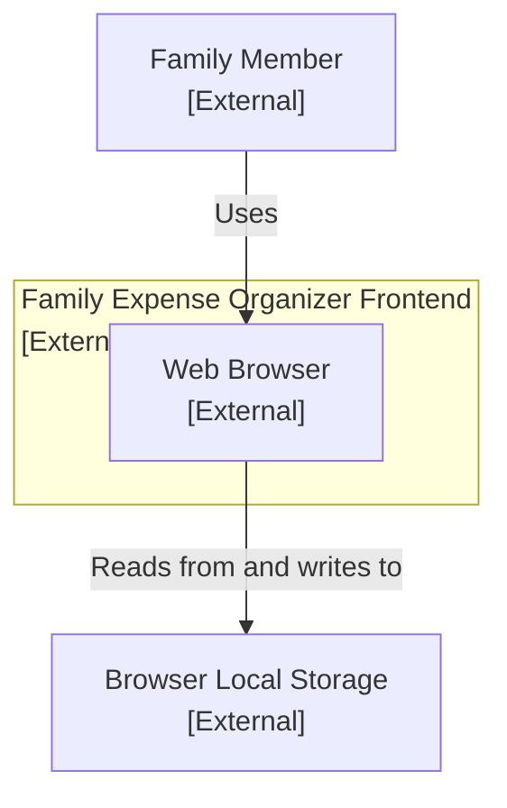

# Unnamed CodeViz Diagram

```mermaid
graph TD

    base.cv::familyMember["Family Member<br>[External]"]
    base.cv::localStorage["Browser Local Storage<br>[External]"]
    subgraph base.cv::frontend["Family Expense Organizer Frontend<br>[External]"]
        base.cv::webBrowser["Web Browser<br>[External]"]
    end
    %% Edges at this level (grouped by source)
    base.cv::familyMember["Family Member<br>[External]"] -->|"Uses"| base.cv::webBrowser["Web Browser<br>[External]"]
    base.cv::webBrowser["Web Browser<br>[External]"] -->|"Reads from and writes to"| base.cv::localStorage["Browser Local Storage<br>[External]"]

```
---
*Generated by [CodeViz.ai](https://codeviz.ai) on 22/11/2025, 1:14:51*
